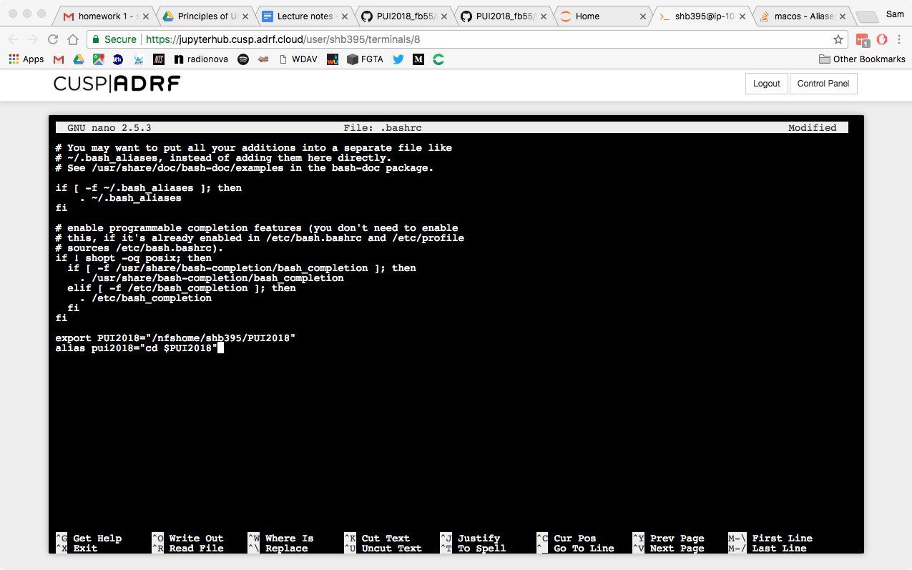
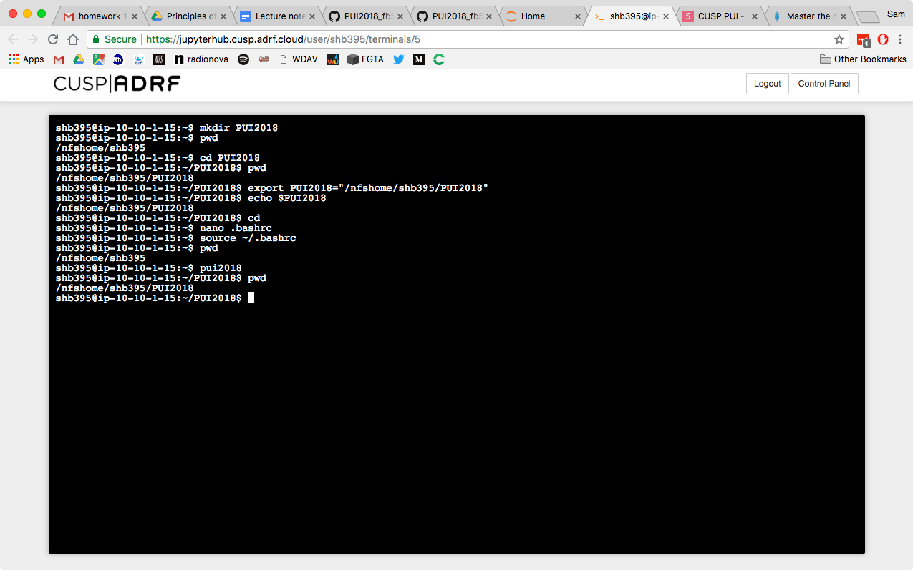

## HW1 Overview

## Creating an Environmental Variable and Alias

For PUI HW1, I created an environmental variable for a file path and an alias with a command to call the directory specified by the environmental variable. The combination of the environmental variable and alias allows me to navigate through my directory more easily.

First, I made a folder called "PUI2018" using mkdir in the terminal. Then I used nano to create a variable (called "PUI2018") that specified the file path to my new "PUI2018" folder. Next, I defined an alias ("pui2018") that would call the directory specified by my PUI2018 variable. See the following screenshot of my new variable and alias:

After having defined the variable and the alias in nano, I navigated back to the terminal and reloaded my .bashrc file using "source ~/.bashrc" to activate my variable and alias. See the following screenshot of my terminal window to see where I activated the variable and alias and then used the alias to navigate through my directory.

## Seeding and Plotting Randomly Generated Numbers

In a separate assignment, I used Jupyter to seed and then create matrices of random numbers and then plot the random numbers in pairs. For my solution to the problem, see the file in this directory called "HW1_3_shb.ipynb."
