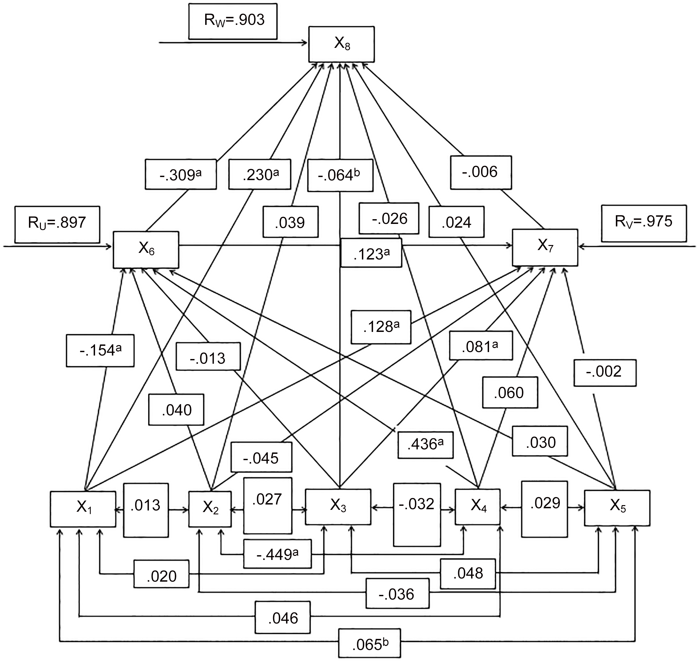

# HW5 Overview

Assignment 1: For this assignment, I reviewed Rohun Iyer's CitiBike data analysis from HW4 (https://github.com/seeess1/PUI2018_ri619) and then chose a statistical test that would be appropriate for his hypothesis. I then submitted a pull request to Rohun on GitHub.

Assignment 2: For this assignment, I reviewed and summarized the methodology of three scientific articles found through PLOS One. See below for more details.

Assignment 3: For assignment 3, I followed the skeleton ipynb file provided by Dr. Federica Bianco and stated the null hypotheses and completed the necessary analyses as prompted by the notebook.

Assignment 4: For assignment 4, I pulled publicly available data from CitiBike for the months of July and December 2017 and performed Kolmogorov–Smirnov tests and found the Pearson correlation coefficient and Spearman correlation coefficient for specific subsets of my data.

Note on Assignment 2: I researched scientific literature with Pablo Andres Mandiola Barriga. We analyzed each article independently but compared our interpretations of specific parts of the articles that we were unclear on. 

Note on Assignments 3 and 4: I discussed the assignment and ways to interpret or clean data with Cyrus Blankenship. We did not explicitly share specific lines of code.

## Assignment 2:

|**Statistical Analyses**	|  **IV(s)** |  **IV type(s)** |  **DV(s)**  |  **DV type(s)**  |  **Control Var** | **Control Var type**  | **Question to be answered** | **$H_0$** | **$\alpha$** | **link to paper** 
|:----------:|:----------|:------------|:-------------|:-------------|:------------|:------------- |:------------------|:----:|:-------:|:-------|
| ANOVA | Level of supervision, presence of others, presence of a "confederate" (ally of the experimenter) | Ordinal, categorical, categorical | Difference in number of assignments completed and number claimed to have been completed by participant | Discrete numerical | The population of students from which participants were drawn | Categorical | Do participants under less supervision or who witness close associates tend to cheat more often on incentivized tasks? | Participants who are not supervised or who witness close associates cheating are less likely to cheat than those who are supervised or who do not witness close associates cheating. | .001 | https://journals.plos.org/plosone/article?id=10.1371/journal.pone.0122305#sec020 |
| Path analysis | Age, place of residence, religion, socioeconomic status, use of family planning methods, education level, and age at first marriage. | Numerical and categorical | Number of unwanted births. | Numerical (discrete) | The study sample was drawn from a nationally representative sample covered by the Bangladesh Demographic and Health Survey | Categorical | Is there a causal connection between the independent variables in this study and unwanted births? | There is no causal connection between any of the independent variables (age, religion, etc.) and the number of unwanted births. | .05 | https://journals.plos.org/plosone/article?id=10.1371/journal.pone.0164007 | 
| Logistic regression | Tobacco smoke exposure (serum cotinine concentration) | Numerical (continuous) | Vitamin D deficiency | Numerical (continuous) | Age, sex, race, BMI, maternal education, and family socio-economic status | Categorical and numerical | Does exposure to tobacco smoke cause decreased vitamin D levels in children? | Children exposed to more tobacco smoke have vitamin D levels that are the same as or higher than vitamin D levels in children exposed to less smoke. | .001 | https://journals.plos.org/plosone/article?id=10.1371/journal.pone.0205342 |
|  | | | | | | | |

## ANOVA results plots:

## Path analysis results plot:

## Logistic regression results plot:

